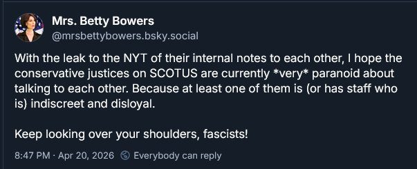
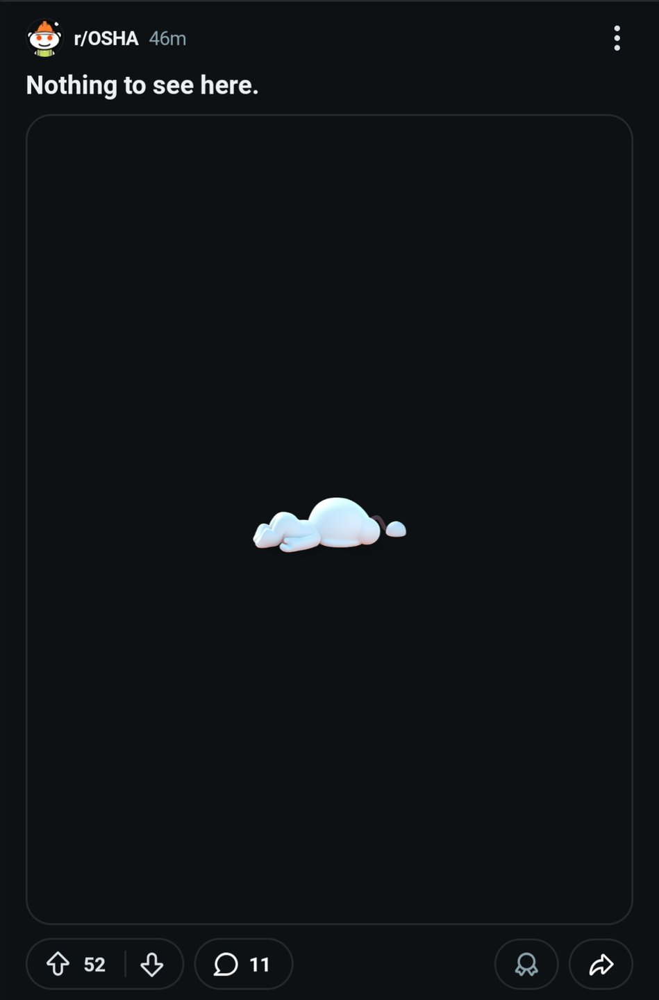

# Meme Feed — 2026-04-22 21:01

**Total:** 20 memes | Refresh every 10 min

---

## This really isn't getting enough attention.

**Score:** 2,971 | **Source:** reddit/r/WhitePeopleTwitter

---

## Proximity to systematic wealth but still being outside of it can have you making

**Score:** 10,335 | **Source:** reddit/r/BlackPeopleTwitter

---

## skins vs skins

**Score:** 1,019 | **Source:** reddit/r/BlackPeopleTwitter

---

## Cops chase and handcuff another cop who was responding to an emergency

**Score:** 5,170 | **Source:** reddit/r/facepalm

---

## Well? Did they accept or not?

**Score:** 828 | **Source:** reddit/r/facepalm

---

## The perfect combination of heading and Reddit mobile jank

**Score:** 233 | **Source:** reddit/r/technicallythetruth

---

## Don't do that

**Score:** 342 | **Source:** reddit/r/oddlyspecific

---

## Darker and darker

**Score:** 284 | **Source:** reddit/r/HolUp

---

## For legal reasons I'm not suggesting anyone actually do this

**Score:** 297 | **Source:** reddit/r/dankmemes

---

## i'm scared

**Score:** 14,467 | **Source:** reddit/r/memes

---

## A responsible Doctor

**Score:** 2,407 | **Source:** reddit/r/memes

---

## *deeply inhales smog*

**Score:** 277 | **Source:** reddit/r/memes

---

## I Don't know why this trend exists, and at this point I'm afraid to ask

**Score:** 51 | **Source:** reddit/r/dankmemes

---

## Don't disturb me

**Score:** 855 | **Source:** reddit/r/dankmemes

---

## r/bald in a nutshell

**Score:** 6,999 | **Source:** reddit/r/memes

---

## i personally think even 67 fails in comparison

**Score:** 7,967 | **Source:** reddit/r/memes

---

## Clankers ruin it once again

**Score:** 396 | **Source:** reddit/r/dankmemes

---

## Now we mememaxxing

**Score:** 721 | **Source:** reddit/r/dankmemes

---

## I'm from very old era, if you know you know

**Score:** 6,260 | **Source:** reddit/r/memes

---

## We all have gone through ts

**Score:** 353 | **Source:** reddit/r/memes

---
