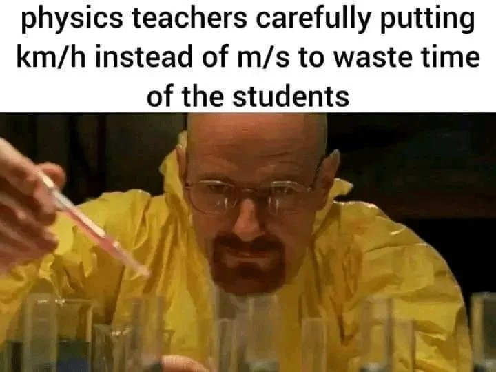

# Meme Feed — 2026-04-22 18:50

**Total:** 20 memes | Refresh every 10 min

---

## None of the things on that wall actually happened lol

**Score:** 1,703 | **Source:** reddit/r/WhitePeopleTwitter

---

## Keep in mind when Across the Spiderverse released it wasn't even finished 💀

**Score:** 6,406 | **Source:** reddit/r/BlackPeopleTwitter

---

## Leave the whales alone

**Score:** 19,184 | **Source:** reddit/r/BlackPeopleTwitter

---

## Well? Did they accept or not?

**Score:** 831 | **Source:** reddit/r/facepalm

---

## Cops chase and handcuff another cop who was responding to an emergency

**Score:** 5,179 | **Source:** reddit/r/facepalm

---

## I cast stairs... Wrong subReddit

**Score:** 2,369 | **Source:** reddit/r/technicallythetruth

---

## He didn't sound like much of anything in there

**Score:** 1,834 | **Source:** reddit/r/technicallythetruth

---

## Among Us Meme

**Score:** 86 | **Source:** reddit/r/suspiciouslyspecific

---

## The chance of someone being able to answer this is very slim.

**Score:** 63 | **Source:** reddit/r/oddlyspecific

---

## AI is everywhere

**Score:** 871 | **Source:** reddit/r/HolUp

---

## the wikipedia entry has over 2300 words

**Score:** 4,056 | **Source:** reddit/r/memes

---

## I Don't know why this trend exists, and at this point I'm afraid to ask

**Score:** 51 | **Source:** reddit/r/dankmemes

---

## Clankers ruin it once again

**Score:** 392 | **Source:** reddit/r/dankmemes

---

## We all have gone through ts

**Score:** 359 | **Source:** reddit/r/memes

---

## *deeply inhales smog*

**Score:** 120 | **Source:** reddit/r/memes

---

## A responsible Doctor

**Score:** 2,409 | **Source:** reddit/r/memes

---

## Is it really necessary?

**Score:** 3,913 | **Source:** reddit/r/memes

---

## Don't disturb me

**Score:** 777 | **Source:** reddit/r/dankmemes

---

## r/bald in a nutshell

**Score:** 6,708 | **Source:** reddit/r/memes

---

## You Okay Babe?

**Score:** 20,080 | **Source:** reddit/r/dankmemes

---
