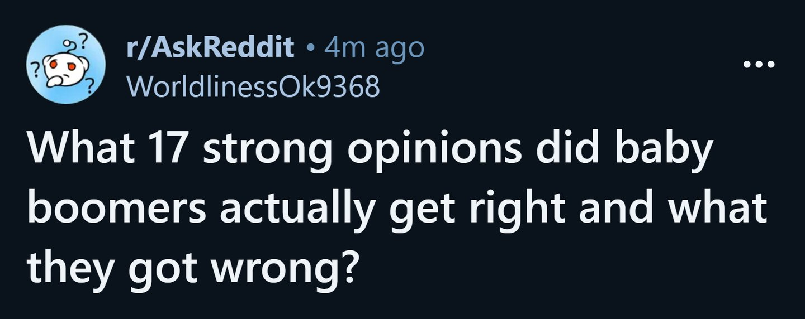
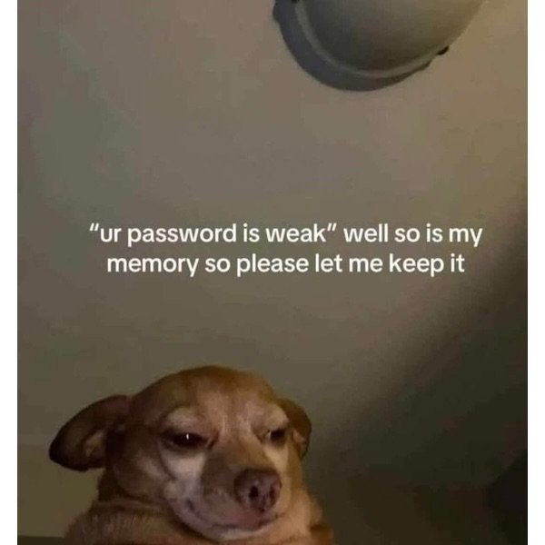

# Meme Feed — 2026-04-22 19:51

**Total:** 20 memes | Refresh every 10 min

---

## "I ain't really hurt. I might just walk off this broken leg"

**Score:** 3,067 | **Source:** reddit/r/BlackPeopleTwitter

---

## At this point, it may even be a genetic trait

**Score:** 7,025 | **Source:** reddit/r/BlackPeopleTwitter

---

## Scammer pretending to be me is letting me know I OK'd paying the scammer.

**Score:** 1,360 | **Source:** reddit/r/facepalm

---

## Super rich or bus driver?

**Score:** 31,009 | **Source:** reddit/r/technicallythetruth

---

## When the sausages are sus

**Score:** 99 | **Source:** reddit/r/suspiciouslyspecific

---

## Don't do that

**Score:** 342 | **Source:** reddit/r/oddlyspecific

---

## 17 strong opinions. No more, no less.

**Score:** 372 | **Source:** reddit/r/oddlyspecific

---

## Now we mememaxxing

**Score:** 709 | **Source:** reddit/r/dankmemes

---

## Don't disturb me

**Score:** 777 | **Source:** reddit/r/dankmemes

---

## Clankers ruin it once again

**Score:** 392 | **Source:** reddit/r/dankmemes

---

## I Don't know why this trend exists, and at this point I'm afraid to ask

**Score:** 51 | **Source:** reddit/r/dankmemes

---

## i'm scared

**Score:** 14,393 | **Source:** reddit/r/memes

---

## We all have gone through ts

**Score:** 359 | **Source:** reddit/r/memes

---

## Is it really necessary?

**Score:** 3,913 | **Source:** reddit/r/memes

---

## *deeply inhales smog*

**Score:** 120 | **Source:** reddit/r/memes

---

## IT: ‘Your password must include 12 characters, a symbol, and a sacrifice.’
Me:

**Score:** 2,057 | **Source:** reddit/r/memes

---

## i personally think even 67 fails in comparison

**Score:** 7,958 | **Source:** reddit/r/memes

---

## A responsible Doctor

**Score:** 2,409 | **Source:** reddit/r/memes

---

## r/bald in a nutshell

**Score:** 6,708 | **Source:** reddit/r/memes

---

## You Okay Babe?

**Score:** 20,080 | **Source:** reddit/r/dankmemes

---
