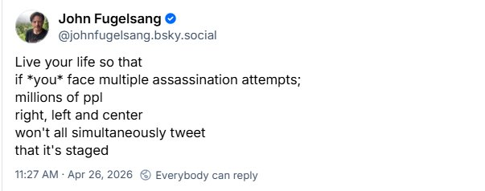
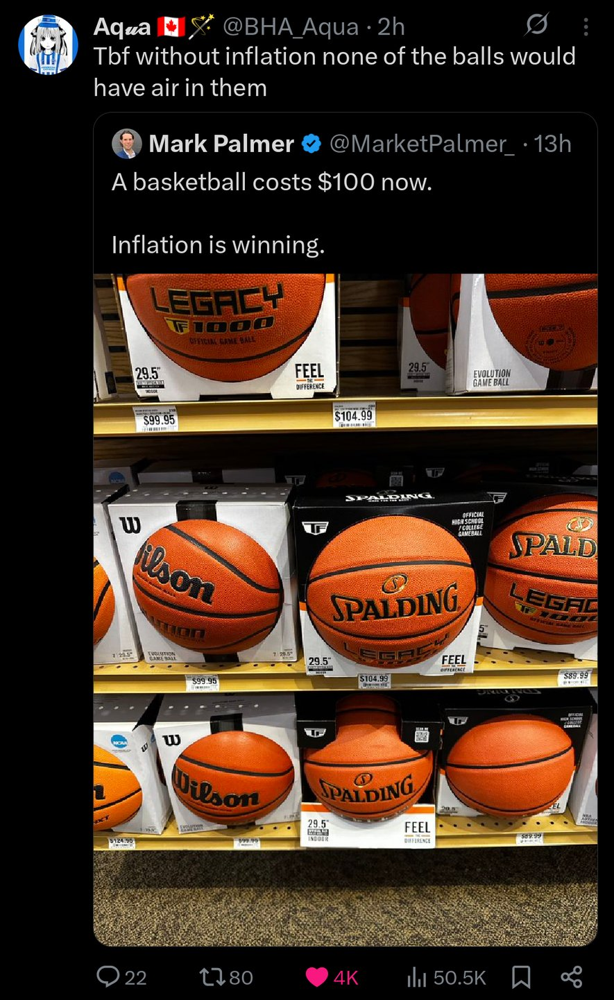
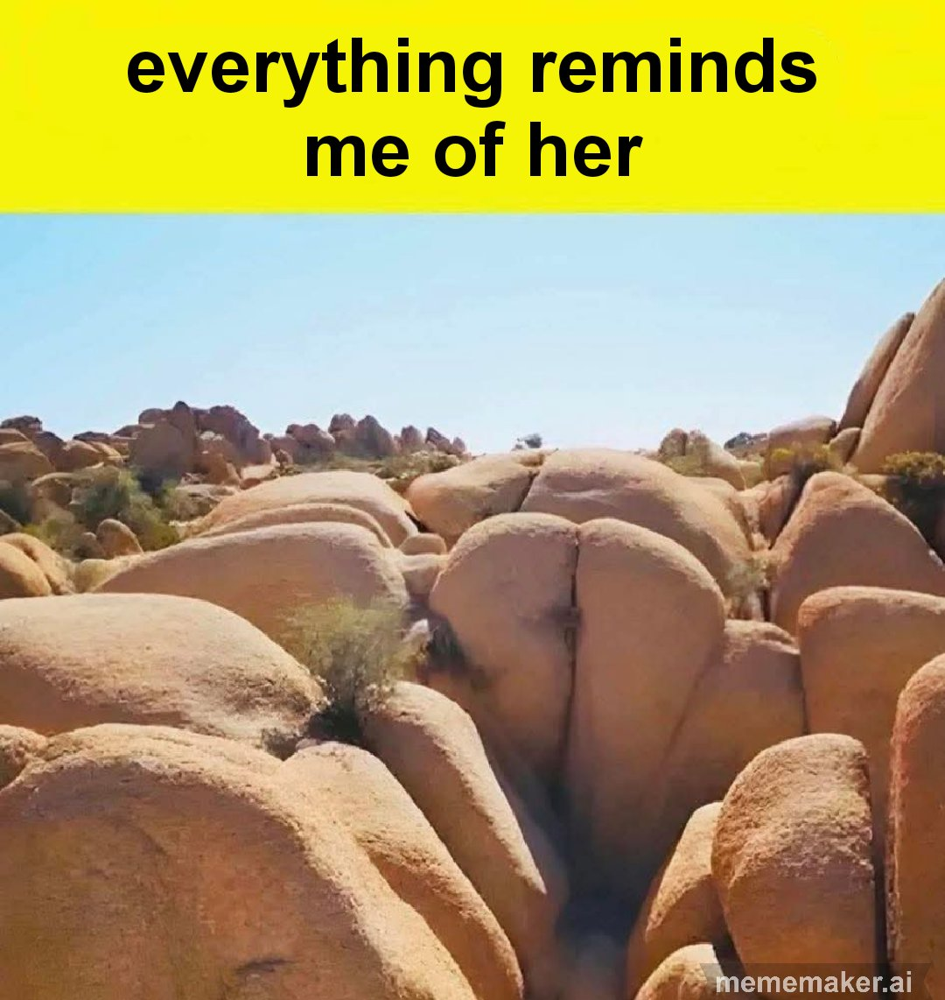

# Meme Feed — 2026-04-27 11:50

**Total:** 20 memes | Refresh every 10 min

---

## It was a beautiful sight when it happened too

**Score:** 101 | **Source:** reddit/r/WhitePeopleTwitter

---

## Here's a tip for you, Donnie

**Score:** 316 | **Source:** reddit/r/WhitePeopleTwitter

---

## Proximity to systematic wealth but still being outside of it can have you making

**Score:** 10,424 | **Source:** reddit/r/BlackPeopleTwitter

---

## Keep an eye out for the quiet ones

**Score:** 5,181 | **Source:** reddit/r/BlackPeopleTwitter

---

## Well? Did they accept or not?

**Score:** 837 | **Source:** reddit/r/facepalm

---

## Scammer pretending to be me is letting me know I OK'd paying the scammer.

**Score:** 1,372 | **Source:** reddit/r/facepalm

---

## Some inflation is good

**Score:** 15,687 | **Source:** reddit/r/technicallythetruth

---

## I cast stairs... Wrong subReddit

**Score:** 2,683 | **Source:** reddit/r/technicallythetruth

---

## My 7 year old would love to know what others think of his drawing! Sus?

**Score:** 1,252 | **Source:** reddit/r/suspiciouslyspecific

---

## Among who?

**Score:** 3,780 | **Source:** reddit/r/suspiciouslyspecific

---

## The chance of someone being able to answer this is very slim.

**Score:** 74 | **Source:** reddit/r/oddlyspecific

---

## An augmented reality sandbox...

**Score:** 605 | **Source:** reddit/r/HolUp

---

## every tiny thing looks suspicious at 3am

**Score:** 264 | **Source:** reddit/r/memes

---

## food waste

**Score:** 1,377 | **Source:** reddit/r/dankmemes

---

## bruh really

**Score:** 3,680 | **Source:** reddit/r/memes

---

## No AI, you cannot help me with this

**Score:** 193 | **Source:** reddit/r/memes

---

## The middle class: :(

**Score:** 93 | **Source:** reddit/r/dankmemes

---

## Lol my homework

**Score:** 132 | **Source:** reddit/r/memes

---

## Inescapable

**Score:** 137 | **Source:** reddit/r/dankmemes

---

## Did you see Piers Morgan wreck Russell Brand last night?

**Score:** 700 | **Source:** reddit/r/memes

---
