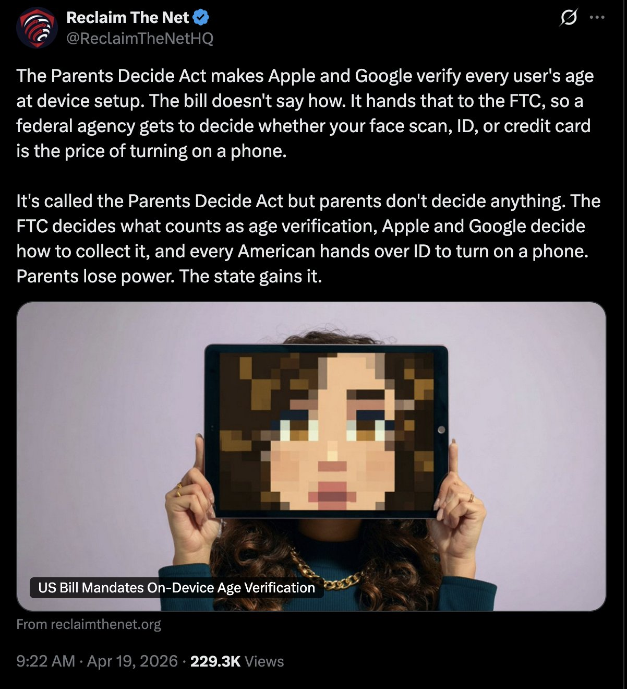
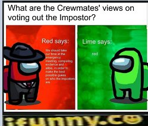

# Meme Feed — 2026-04-22 14:20

**Total:** 20 memes | Refresh every 10 min

---

## Interesting...

**Score:** 2,853 | **Source:** reddit/r/WhitePeopleTwitter

---

## call your representatives

**Score:** 231 | **Source:** reddit/r/WhitePeopleTwitter

---

## At this point, it may even be a genetic trait

**Score:** 7,023 | **Source:** reddit/r/BlackPeopleTwitter

---

## He's really on top

**Score:** 1,929 | **Source:** reddit/r/BlackPeopleTwitter

---

## Well? Did they accept or not?

**Score:** 827 | **Source:** reddit/r/facepalm

---

## Scammer pretending to be me is letting me know I OK'd paying the scammer.

**Score:** 1,362 | **Source:** reddit/r/facepalm

---

## Some inflation is good

**Score:** 15,680 | **Source:** reddit/r/technicallythetruth

---

## crewmates views on voting out the impostor!

**Score:** 4,485 | **Source:** reddit/r/suspiciouslyspecific

---

## The chance of someone being able to answer this is very slim.

**Score:** 61 | **Source:** reddit/r/oddlyspecific

---

## Darker and darker

**Score:** 281 | **Source:** reddit/r/HolUp

---

## Now we mememaxxing

**Score:** 693 | **Source:** reddit/r/dankmemes

---

## It's in the blood

**Score:** 241 | **Source:** reddit/r/dankmemes

---

## A responsible Doctor

**Score:** 2,372 | **Source:** reddit/r/memes

---

## the wikipedia entry has over 2300 words

**Score:** 3,718 | **Source:** reddit/r/memes

---

## Don't disturb me

**Score:** 617 | **Source:** reddit/r/dankmemes

---

## And Whitehouse press conferences too.

**Score:** 223 | **Source:** reddit/r/dankmemes

---

## Is it really necessary?

**Score:** 3,764 | **Source:** reddit/r/memes

---

## For legal reasons I'm not suggesting anyone actually do this

**Score:** 246 | **Source:** reddit/r/dankmemes

---

## r/bald in a nutshell

**Score:** 5,709 | **Source:** reddit/r/memes

---

## i personally think even 67 fails in comparison

**Score:** 7,929 | **Source:** reddit/r/memes

---
